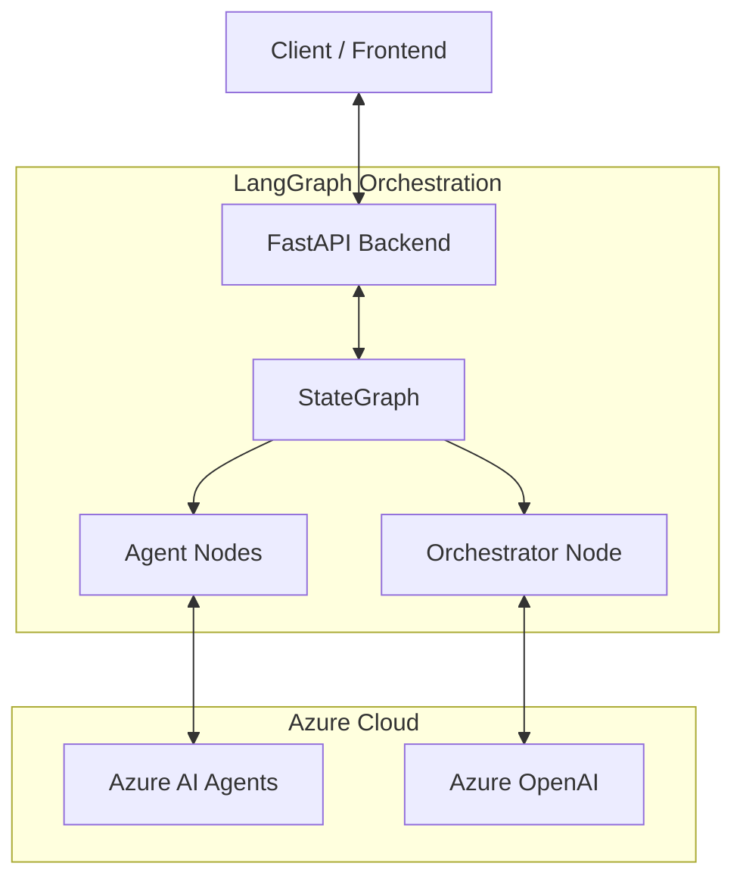
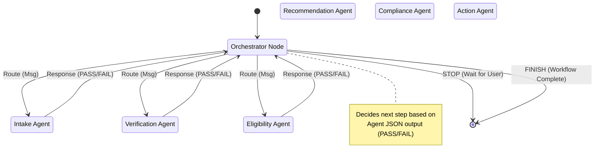
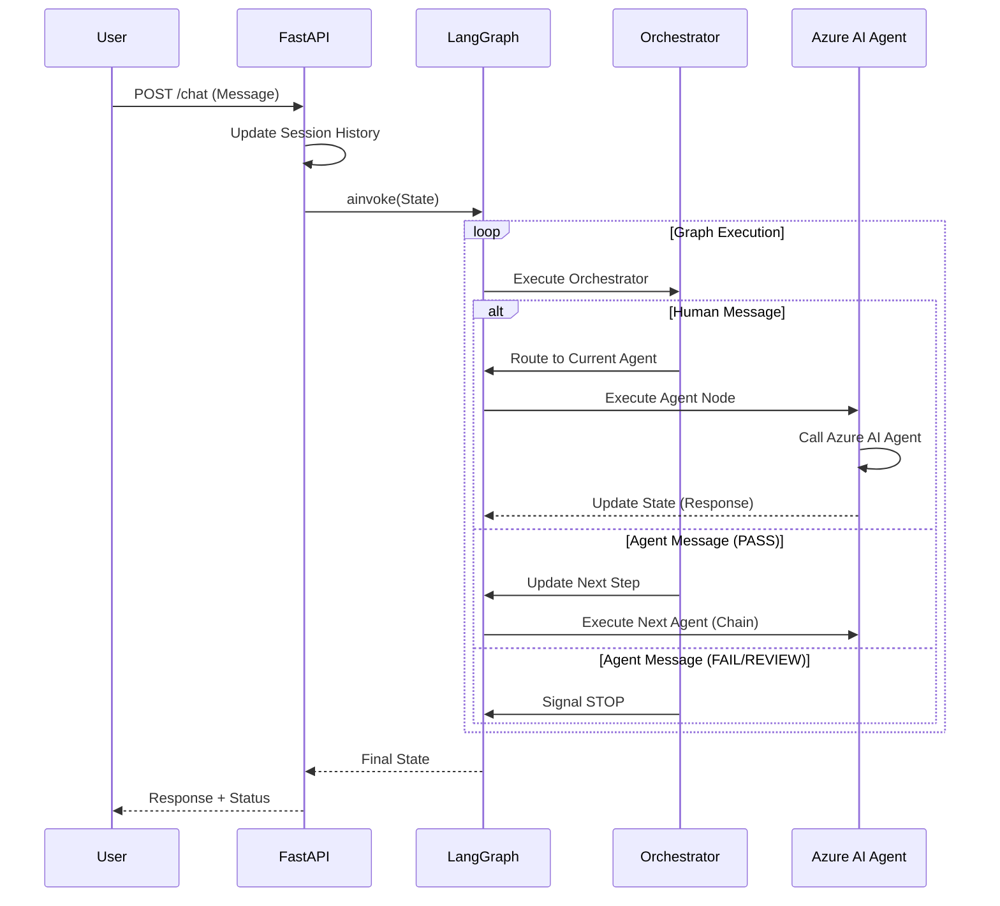

# Azure AI Agents KYC Orchestrator Documentation

## System Overview

The **Azure AI Agents KYC Orchestrator** is an intelligent backend system designed to manage Know Your Customer (KYC) processes for insurance applications. It leverages **Azure AI Agents** (formerly Assistants API) to perform specific tasks like customer intake, identity verification, and eligibility assessment.

The core of the system has been refactored to use **LangGraph**, enabling dynamic, state-aware orchestration where a central orchestrator node determines the flow of the conversation and process based on agent outputs.

## Architecture

The system is built using **FastAPI** and integrates with Azure services.

### Key Components

- **FastAPI Backend**: Exposes REST endpoints for the frontend or external systems.
- **LangGraph Orchestrator**: Manages the state and flow of the KYC process.
- **Azure AI Agents**: Specialized agents configured in Azure AI Foundry (Intake, Verification, etc.).
- **Azure OpenAI**: Provides the intelligence for the orchestrator (and potentially fallback responses).



## Orchestration Flow (LangGraph)

The orchestration logic is defined in a **StateGraph**. The system moves between an **Orchestrator** node and various **Agent** nodes.

### State Machine

1.  **Orchestrator**: Analyzes the current state and the last message.
    *   If the last message is from a **Human**, it routes to the **Current Step's Agent**.
    *   If the last message is from an **Agent** (AI), it checks the decision:
        *   **PASS**: Advances to the next step (e.g., Intake -> Verification).
        *   **FAIL/REVIEW**: Stops and waits for user input.
2.  **Agent Nodes**: Call the specific Azure AI Agent, update the conversation history, and return the agent's response.



## API Workflows

### Chat Interaction (`/chat/{session_id}`)

The primary interaction point is the chat endpoint. It handles user messages, invokes the graph, and returns the assistant's response.



## Data Models

### AgentState (Temporary Execution Context)

`AgentState` is a TypedDict defined in `graph.py` that represents the **temporary state during a single graph execution**. It is **ephemeral** and only exists for the duration of one `app_graph.ainvoke()` call.

**Structure:**
```python
class AgentState(TypedDict):
    messages: Annotated[List[BaseMessage], add_messages]  # LangChain messages (Human/AI)
    customer_data: Dict[str, Any]                         # Customer information
    next_step: str                                        # Current workflow step
    step_results: Dict[str, Any]                          # Agent execution results
    session_id: str                                       # Session identifier
    thread_ids: Dict[str, str]                            # Azure AI thread IDs per agent
    final_response: str                                   # Last agent response
    routing_signal: str                                   # "GO" or "STOP"
```

**Important:** `AgentState` is **NOT** the primary memory mechanism. It's populated from the persistent session storage at the start of each request and its results are saved back to the session at the end.

### Session Storage (Persistent Memory)

The **actual persistent memory** is maintained in the `sessions` dictionary in `main.py`, which is backed by a `sessions.json` file on disk. This persists across server restarts and all user calls.

#### Session Dictionary Structure

```python
sessions[session_id] = {
    # === Core Session Metadata ===
    "status": str,              # "in_progress" | "complete"
    "step": str,                # Current workflow step
    "created_at": float,        # Unix timestamp of session creation
    "user_type": str,           # "insurance_employee"
    
    # === Customer Information ===
    "customer": {
        # Initial data (from CustomerInput):
        "name": str,                    # Customer's full name
        "email": str,                   # Customer's email address
        "insurance_needs": str,         # Description of insurance needs
        "documents": dict,              # Document references
        
        # Dynamically extracted data (from chat messages):
        "date_of_birth": str,           # Extracted via regex patterns
        "address": str,                 # Extracted via keyword indicators
        "consent": str,                 # "confirmed" when detected
        "documents_mentioned": str,     # Raw message text about documents
        # ... other fields added dynamically
    },
    
    # === Conversation History ===
    "chat_history": [
        {
            "role": str,        # "user" | "assistant"
            "content": str,     # Message content
            "timestamp": str,   # Unix timestamp as string
            "agent_step": str   # (optional) Which agent generated this
        },
        # ... chronological message history
    ],
    
    # === Agent Execution Results ===
    "step_results": {
        "intake": [            # Array of results for each step
            {
                "response": str,      # Agent's response text
                "thread_id": str,     # Azure AI Agent thread ID
                # ... other agent-specific data
            }
        ],
        "verification": [...],
        "eligibility": [...],
        # ... one array per workflow step
    },
    
    # === Thread Management ===
    "thread_ids": {
        "intake": str,         # Azure AI Agent thread ID for intake
        "verification": str,   # Thread ID for verification agent
        "eligibility": str,    # Thread ID for eligibility agent
        # ... one per agent/step for conversation continuity
    }
}
```

#### Data Categories

1. **Session Metadata** (4 fields)
   - Tracks workflow state, timestamps, and user context
   - Updated as the workflow progresses

2. **Customer Data** (dynamic dictionary)
   - **Initial fields**: Provided at session start (name, email, insurance_needs, documents)
   - **Extracted fields**: Automatically extracted from chat messages using regex and keyword detection
     - `date_of_birth`: Patterns like `DD/MM/YYYY` or `YYYY-MM-DD`
     - `address`: Detected via indicators like "address:", "lives at", etc.
     - `consent`: Flagged when consent keywords are found
     - `documents_mentioned`: Captured when document types are mentioned
   - Can grow dynamically as agents extract additional information

3. **Chat History** (array)
   - Complete chronological conversation log
   - Includes both user messages and AI agent responses
   - Each message has timestamp and role attribution
   - Agent messages include which step/agent generated them

4. **Step Results** (nested dictionary)
   - Raw responses from each Azure AI Agent
   - Organized by workflow step (intake, verification, etc.)
   - Stores multiple results per step if a step is revisited
   - Used by orchestrator to determine PASS/FAIL decisions

5. **Thread IDs** (dictionary)
   - Maps each agent to its Azure AI thread ID
   - Enables conversation continuity with each specialized agent
   - Allows agents to maintain context across multiple interactions

#### Memory Persistence Flow

The system uses a two-tier memory architecture:

```
User Request → Load Session → Create AgentState → Graph Execution → Update Session → Save to Disk
     ↓              ↓               ↓                    ↓                ↓              ↓
  /chat      sessions[id]    Temporary State      LangGraph Nodes   sessions[id]   sessions.json
```

**Step-by-step:**

1. **Load**: Session data loaded from `sessions` dict (which is loaded from `sessions.json` on startup)
2. **Transform**: Session data converted to `AgentState` format for LangGraph
3. **Execute**: Graph processes the state through orchestrator and agent nodes
4. **Extract**: Results extracted from final `AgentState`
5. **Persist**: Session updated with new data and saved to `sessions.json`

**Code Example (from `/chat` endpoint):**
```python
# 1. Load persistent data from session
initial_state = {
    "messages": lc_messages,              # From session["chat_history"]
    "customer_data": session["customer"],  # From session["customer"]
    "step_results": session.get("step_results", {}),
    "thread_ids": session.get("thread_ids", {}),
    # ...
}

# 2. Execute graph with temporary state
final_state = await app_graph.ainvoke(initial_state)

# 3. Save results back to persistent session
session["customer"] = final_state["customer_data"]
session["step_results"] = final_state["step_results"]
session["thread_ids"] = final_state["thread_ids"]
save_sessions()  # Persist to disk
```

#### Production Considerations

⚠️ **Current Implementation**: File-based storage (`sessions.json`)
- Suitable for development and testing
- Simple, no external dependencies
- Persists across server restarts
- **Limitations**: Not suitable for production (no horizontal scaling, no concurrent access control)

✅ **Recommended for Production**: 
- **Redis** or **Azure Cache for Redis**: For distributed session storage
- **Azure Cosmos DB**: For durable, globally distributed storage
- **Azure Table Storage**: For cost-effective structured storage

The session structure is designed to be easily migrated to any key-value or document store.

## Setup and Usage

### Prerequisites
- Python 3.10+
- Azure OpenAI API Key
- Azure AI Project Connection String

### Installation
The project uses a virtual environment for dependency management.

```bash
# Create and activate virtual environment
python3 -m venv venv
source venv/bin/activate

# Install dependencies
pip install -r requirements.txt
```

### Running the Server
```bash
uvicorn main:app --reload
```

### Running Tests
```bash
pytest tests/test_graph_flow.py
```
