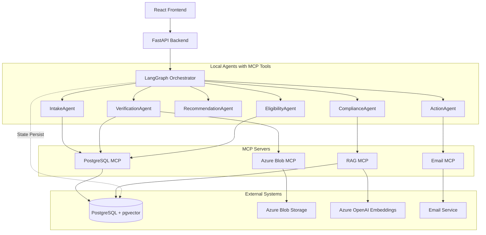
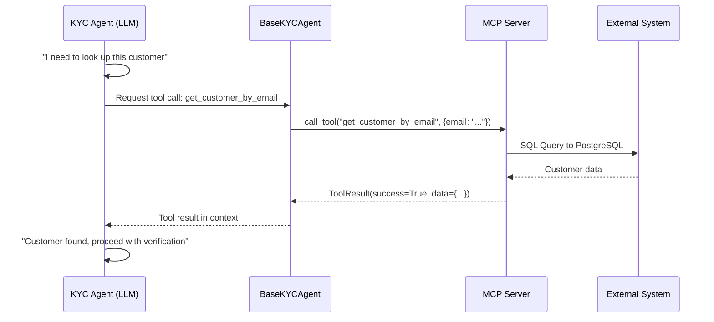
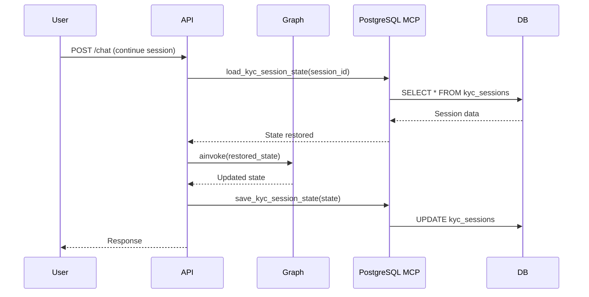

# Agentic MCP Integration Architecture

Transform KYC agents from simple LLM callers to truly agentic systems that can autonomously access external data, retrieve documents, check compliance policies, and notify customers.

## System Architecture



---

## How MCP Works in This System

**MCP (Model Context Protocol)** is an open standard that enables LLM-based agents to interact with external systems through a standardized interface. In this KYC system, MCP bridges the gap between AI agents and real-world data.

### The Core Concept

Instead of hardcoding external API calls into agents, MCP provides a **tool abstraction layer**:



### How It Works Step-by-Step

1. **Agent Initialization**: When the FastAPI app starts, MCP servers are initialized in `main.py`:
   ```python
   mcp_postgres = PostgresMCPServer()
   mcp_blob = BlobMCPServer()
   initialize_mcp_servers({"postgres": mcp_postgres, "blob": mcp_blob, ...})
   ```

2. **Tool Registration**: Each agent declares which tools it can use:
   ```python
   class IntakeAgent(BaseKYCAgent):
       @property
       def available_tools(self):
           return ["postgres.get_customer_by_email", "postgres.get_customer_history"]
   ```

3. **Agentic Loop**: When an agent runs, the LLM can request tool calls:
   - LLM receives customer data + conversation history
   - LLM decides: "I should look up this customer in CRM"
   - LLM outputs a tool call request
   - `BaseKYCAgent.invoke()` detects tool calls and routes to MCP server
   - MCP server executes the operation and returns results
   - Results are fed back to LLM for final decision

4. **Multi-Turn Tool Calling**: Agents can make up to 3 tool calls per invocation:
   ```
   Turn 1: LLM → "get_customer_by_email" → Customer found
   Turn 2: LLM → "get_customer_history" → Previous orders retrieved  
   Turn 3: LLM → Final decision with all data
   ```

### Why MCP?

| Without MCP | With MCP |
|-------------|----------|
| Agents need custom code for each external system | Standardized tool interface |
| Tightly coupled to external APIs | Loosely coupled, swappable backends |
| Hard to test (mocking complex APIs) | Easy to mock MCP servers in tests |
| Each agent duplicates integration logic | Shared MCP servers across all agents |

### MCP Server Interface

Each MCP server implements:

```python
class BaseMCPServer:
    @property
    def name(self) -> str:              # "postgres", "blob", etc.
    
    def get_tools(self) -> List[Dict]:   # Tool definitions (name, description, parameters)
    
    async def call_tool(self, name, args) -> ToolResult:  # Execute tool
```

The `ToolResult` returned contains:
- `success`: bool
- `data`: Any (the actual result)
- `error`: Optional error message

---

## MCP Servers

### 1. PostgreSQL MCP Server

**Purpose**: Access customer CRM data for returning customers.

**Tools exposed**:
| Tool | Description |
|------|-------------|
| `get_customer_by_email` | Lookup contact + account by email |
| `get_customer_history` | Get orders, quotes, invoices for customer |
| `get_previous_kyc_sessions` | List past KYC sessions |
| `save_kyc_session_state` | Persist current session state |
| `load_kyc_session_state` | Restore session from checkpoint |
| `delete_kyc_session` | Delete a KYC session (for cleanup/testing) |

**Used by**: IntakeAgent, VerificationAgent, EligibilityAgent

---

### 2. Azure Blob MCP Server

**Purpose**: Store and retrieve customer documents (ID, proof of address, etc.)

**Folder structure**:
```
kyc-documents/
└── customers/
    ├── Customer123/
    │   ├── id/
    │   │   └── passport.pdf
    │   ├── address/
    │   │   └── utility_bill.pdf
    │   └── consent/
    │       └── signed_consent.pdf
    └── Customer456/
        └── ...
```

**Tools exposed**:
| Tool | Description |
|------|-------------|
| `list_customer_documents` | List all docs for a customer (by account_id) |
| `get_document_url` | Get SAS URL for document download |
| `upload_document` | Store new document in `customers/Customer<account_id>/` |
| `get_document_metadata` | Get doc type, upload date, etc. |
| `delete_document` | Delete a document (for cleanup/testing) |

**Used by**: VerificationAgent

---

### 3. Email MCP Server

**Purpose**: Send KYC outcome notifications to customers.

**Tools exposed**:
| Tool | Description |
|------|-------------|
| `send_kyc_approved_email` | Send approval notification |
| `send_kyc_pending_email` | Send pending/review notification |
| `send_kyc_rejected_email` | Send rejection with reasons |
| `send_follow_up_email` | Request additional documents |

**Used by**: ActionAgent

---

### 4. RAG MCP Server (Policy Compliance)

**Purpose**: Query company policies stored in pgvector for compliance checks.

**Tools exposed**:
| Tool | Description |
|------|-------------|
| `search_policies` | Semantic search over policy docs |
| `get_policy_requirements` | Get specific requirements for product |
| `check_compliance` | Verify customer meets policy requirements |
| `list_policy_categories` | List available policy categories |
| `delete_policy_document` | Delete policy chunks by filename (cleanup/testing) |

**Resources exposed**:
| Resource | Description |
|----------|-------------|
| `policy://categories` | List policy categories |
| `policy://recent` | Recently updated policies |

**Admin/Frontend Endpoints** (FastAPI):
- `POST /policies/upload-file` - Upload PDF/Word file, convert to Markdown (via `docling`), chunk, embed, and store.
- `GET /policies/documents` - List all indexed documents with status and stats.
- `GET /policies/documents/{filename}` - Get document details and sample chunks.
- `DELETE /policies/documents/{filename}` - Delete document and all associated embeddings.

**Document Processing Pipeline**:
1. **Ingestion**: Accepts `.pdf`, `.docx`, `.doc`.
2. **Conversion**: Uses `docling` to convert binary docs to clean Markdown.
3. **Chunking**: Splits text into chunks (configurable size, default 1000 chars) using `RecursiveCharacterTextSplitter`.
4. **Embedding**: Generates vector embeddings via Azure OpenAI.
5. **Storage**: Saves text chunks + embeddings + metadata to `policy_documents`.

**Used by**: ComplianceAgent, EligibilityAgent

---

## Database Schema Extensions

#### [NEW] `kyc_sessions` - Workflow State Persistence

```sql
CREATE TABLE kyc_sessions (
    id UUID PRIMARY KEY,
    contact_id BIGINT REFERENCES contacts(id),
    status VARCHAR(50) NOT NULL,
    current_step VARCHAR(50) NOT NULL,
    customer_data JSONB NOT NULL,
    step_results JSONB DEFAULT '{}',
    chat_history JSONB DEFAULT '[]',
    created_at TIMESTAMP DEFAULT NOW(),
    updated_at TIMESTAMP DEFAULT NOW()
);
CREATE INDEX idx_kyc_sessions_contact ON kyc_sessions(contact_id);
```

#### [NEW] `policy_documents` - RAG Document Store

```sql
CREATE EXTENSION IF NOT EXISTS vector;

CREATE TABLE policy_documents (
    id BIGSERIAL PRIMARY KEY,
    filename VARCHAR(255) NOT NULL,
    original_filename VARCHAR(255),
    category VARCHAR(100),
    content TEXT NOT NULL,
    chunk_index INT NOT NULL,
    embedding vector(1536),  -- Azure OpenAI ada-002
    uploaded_at TIMESTAMP DEFAULT NOW(),
    status VARCHAR(50) DEFAULT 'indexed', -- pending, processing, indexed, error
    error_message TEXT,
    chunk_size INT,
    total_chunks INT
);

CREATE INDEX idx_policy_embedding ON policy_documents 
    USING ivfflat (embedding vector_cosine_ops) WITH (lists = 100);
```

---

## File Structure

```
mcp_servers/
├── __init__.py
├── base.py              # Base MCP server utilities
├── postgres_server.py   # PostgreSQL CRM + state persistence
├── blob_server.py       # Azure Blob document storage
├── email_server.py      # Email notifications
└── rag_server.py        # Policy RAG with pgvector
```

---

## Agent Tool Bindings

| Agent | MCP Tools |
|-------|-----------|
| **IntakeAgent** | `get_customer_by_email`, `get_customer_history` |
| **VerificationAgent** | `list_customer_documents`, `get_document_url`, `get_customer_by_email` |
| **EligibilityAgent** | `get_customer_history`, `search_policies` |
| **RecommendationAgent** | `get_customer_history`, `search_policies` |
| **ComplianceAgent** | `search_policies`, `check_compliance`, `get_policy_requirements` |
| **ActionAgent** | `send_kyc_approved_email`, `send_kyc_pending_email`, `save_kyc_session_state` |

---

## State Persistence Flow



---

## Environment Variables Required

```env
# PostgreSQL
POSTGRES_HOST=localhost
POSTGRES_PORT=5432
POSTGRES_DB=kyc_crm
POSTGRES_USER=postgres
POSTGRES_PASSWORD=secret

# Document Conversion
# No API key required for local docling, but requires standard machine learning libraries


# Azure Blob
AZURE_STORAGE_CONNECTION_STRING=...
AZURE_BLOB_CONTAINER=kyc-documents

# Azure OpenAI (for embeddings)
AZURE_OPENAI_ENDPOINT=...
AZURE_OPENAI_API_KEY=...
AZURE_OPENAI_EMBEDDING_DEPLOYMENT=text-embedding-ada-002

# Email (SendGrid or SMTP)
SENDGRID_API_KEY=...
EMAIL_FROM=your-verified-sender@example.com  # Must be a verified sender in SendGrid
# or
SMTP_HOST=smtp.example.com
SMTP_PORT=587
SMTP_USER=...
SMTP_PASSWORD=...
#EMAIL_FROM=kyc@insurance.com
```

> [!IMPORTANT]
> For SendGrid, `EMAIL_FROM` must be a **verified sender** in your SendGrid account. Go to SendGrid Dashboard → Settings → Sender Authentication to verify your sender email.

---

## Verification Plan

### Automated Tests
```bash
# Test MCP servers individually
pytest tests/test_mcp_postgres.py -v
pytest tests/test_mcp_blob.py -v
pytest tests/test_mcp_email.py -v
pytest tests/test_mcp_rag.py -v
pytest tests/test_document_processor.py -v # Test RAG document conversion & processing

# Test agent-MCP integration
pytest tests/test_agent_tools.py -v
```

### Connection Testing

Before running the full system, verify that all external service connections are working:

```bash
# Set up virtual environment (first time only)
python3 -m venv venv
source venv/bin/activate
pip install python-dotenv openai azure-storage-blob psycopg2-binary requests

# Run all connection tests
source venv/bin/activate && python tests/run_all_connection_tests.py
```

Individual component tests are also available:
| Test Script | Component |
|-------------|-----------|
| `tests/test_azure_openai_connection.py` | Azure OpenAI Chat (LLM) |
| `tests/test_azure_embeddings_connection.py` | Azure OpenAI Embeddings |
| `tests/test_postgresql_connection.py` | PostgreSQL Database |
| `tests/test_azure_blob_connection.py` | Azure Blob Storage |
| `tests/test_sendgrid_connection.py` | SendGrid Email API |

> [!NOTE]
> For Azure Blob Storage, ensure **"Allow storage account key access"** is enabled in your Storage Account's Configuration settings (Azure Portal → Storage Account → Settings → Configuration).

### MCP Server Integration Testing

After verifying connections, run MCP server integration tests to verify the tools work correctly:

```bash
# Run all MCP server integration tests
source venv/bin/activate && python tests/run_mcp_integration_tests.py
```

| Test Script | MCP Server | Tests |
|-------------|------------|-------|
| `test_mcp_postgres_integration.py` | PostgreSQL | CRUD for KYC sessions |
| `test_mcp_blob_integration.py` | Azure Blob | Upload, list, metadata, SAS URL, delete documents |
| `test_mcp_rag_integration.py` | RAG | Policy search, compliance checks |
| `test_mcp_email_integration.py` | Email | Email sending (mock mode by default) |

> [!NOTE]
> For SendGrid email, ensure your API key has **"Mail Send"** permission enabled. If you get a 403 error, go to SendGrid → Settings → API Keys → Edit → Enable "Mail Send".

### Manual Verification
1. Start PostgreSQL with schema + test data
2. Start Azure Blob emulator (Azurite) or use real storage
3. Upload sample policy documents
4. Run end-to-end KYC flow with returning customer
5. Verify email received at test address

---

> [!IMPORTANT]
> This architecture uses `fastmcp` library for MCP server implementation. Each server runs as a separate process or can be embedded in the FastAPI app.
