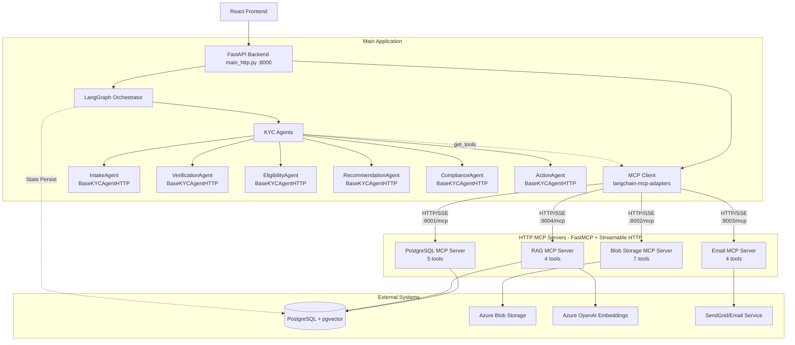
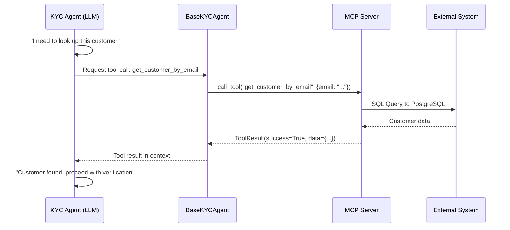
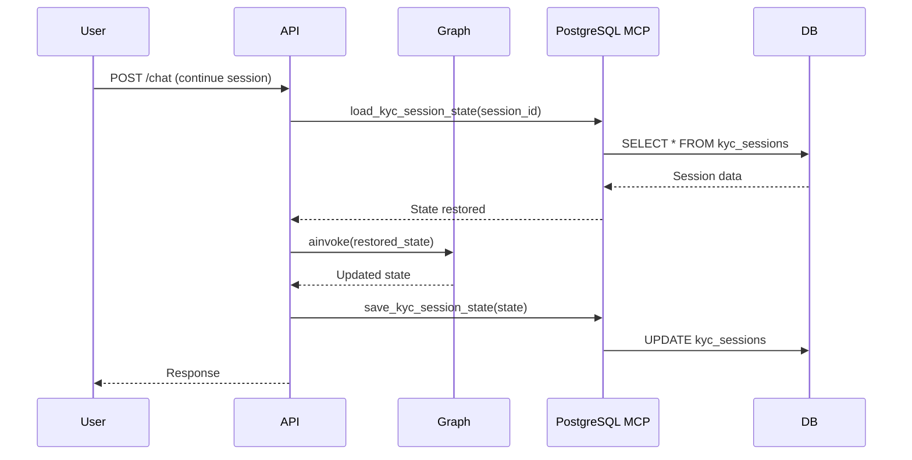

# Agentic MCP Integration Architecture

Transform KYC agents from simple LLM callers to truly agentic systems that can autonomously access external data, retrieve documents, check compliance policies, and notify customers.

## Overview

Agents inherit from `BaseKYCAgentHTTP` and use HTTP MCP servers (independent services). Tools are loaded from HTTP MCP client, and the LLM autonomously decides when to call tools. The system runs via `main_http.py`.

**Key Benefit**: Agents are now truly agentic - they autonomously decide when they need external data and call the appropriate MCP tools via HTTP.

## ⚡ Quick Start

**Prerequisites**: Make sure you have all environment variables set in `.env` (see Environment Variables section below)

```bash
# 1. Start all 4 MCP servers (REQUIRED FIRST!)
uvicorn mcp_servers.postgres_server:app --port 8001 &
uvicorn mcp_servers.blob_server:app --port 8002 &
uvicorn mcp_servers.email_server:app --port 8003 &
uvicorn mcp_servers.rag_server:app --port 8004 &

# 2. Verify servers are running
curl http://127.0.0.1:8001/health  # Should return {"status":"ok"}

# 3. Start main application (HTTP MCP architecture)
uvicorn main_http:app --reload --port 8000

# 4. Test tool calling (optional)
python test_tool_binding.py  # Verify agents can call tools
```

> [!IMPORTANT]
> **Always use `main_http.py`** (HTTP MCP architecture) - NOT `main.py` (legacy embedded MCP)

## System Architecture



**Key Architecture Features:**
- **HTTP-based MCP**: Servers run as independent HTTP services using FastMCP
- **Streamable HTTP Protocol**: Uses MCP's official protocol with SSE for tool responses
- **Port-based Isolation**: Each server on dedicated port (8001-8004)
- **Client Integration**: `langchain-mcp-adapters` MultiServerMCPClient loads 20 tools from all servers
- **Agentic Tool Calling**: Agents inherit from `BaseKYCAgentHTTP` and LLM decides when to call tools
- **Health Monitoring**: Each server exposes `/health` endpoint for monitoring

---

## How MCP Works in This System

**MCP (Model Context Protocol)** is an open standard that enables LLM-based agents to interact with external systems through a standardized interface. In this KYC system, MCP bridges the gap between AI agents and real-world data.

### The Core Concept

Instead of hardcoding external API calls into agents, MCP provides a **tool abstraction layer**:



### How It Works Step-by-Step

1. **MCP Server Startup**: Each MCP server runs as an independent HTTP service:
   ```bash
   # Start all 4 MCP servers
   uvicorn mcp_servers.postgres_server:app --host 127.0.0.1 --port 8001 &
   uvicorn mcp_servers.blob_server:app --host 127.0.0.1 --port 8002 &
   uvicorn mcp_servers.email_server:app --host 127.0.0.1 --port 8003 &
   uvicorn mcp_servers.rag_server:app --host 127.0.0.1 --port 8004 &
   ```
   Each server exposes:
   - `GET /health` - Health check endpoint
   - `GET/POST /mcp` - MCP Streamable HTTP protocol (SSE + JSON-RPC)

2. **MCP Client Initialization**: When FastAPI app starts (`main_http.py`):
   ```python
   from mcp_client import mcp_client  # Global singleton
   
   @asynccontextmanager
   async def lifespan(app: FastAPI):
       await mcp_client.initialize()  # Connects to all 4 servers via HTTP
       yield
       await mcp_client.close()
   ```
   The client uses `langchain-mcp-adapters` to connect to all servers and loads 20 tools.

3. **Agent Tool Access**: Each agent inherits from `BaseKYCAgentHTTP` and declares which tools it needs:
   ```python
   class IntakeAgent(BaseKYCAgentHTTP):
       @property
       def available_tools(self):
           return [
               "postgres.get_customer_by_email",
               "postgres.get_customer_history"
           ]
   ```
   When invoked, agent:
   - Calls `get_mcp_client()` to access HTTP MCP client
   - Gets all 20 tools from HTTP servers
   - Filters to only its `available_tools`
   - Binds filtered tools to LLM using `.bind_tools()`

4. **Agentic Loop**: When an agent runs, the LLM autonomously decides when to call tools:
   - LLM receives customer data + conversation history
   - LLM analyzes: "Do I have enough information to decide?"
   - If NO → LLM outputs tool call request (e.g., `postgres__get_customer_by_email`)
   - `BaseKYCAgentHTTP.invoke()` detects tool calls and executes them
   - Tool execution: HTTP request to MCP server (e.g., POST to :8001/mcp)
   - Server executes via FastMCP's tool handler, returns result
   - Result fed back to LLM as ToolMessage
   - LLM analyzes again with new data
   - If YES → LLM outputs final decision in JSON format

5. **Multi-Turn Tool Calling**: Agents can make up to 5 tool calls per invocation:
   ```
   Turn 1: LLM → "I need to check this customer"
           → Calls postgres__get_customer_by_email
           → HTTP POST to :8001/mcp
           → Result: Customer record found
   
   Turn 2: LLM → "Found customer, let me check their documents"
           → Calls blob__list_customer_documents
           → HTTP POST to :8002/mcp
           → Result: 3 documents uploaded
   
   Turn 3: LLM → "All data collected, making decision"
           → Returns final JSON decision (PASS/REVIEW/FAIL)
   ```

### Why MCP?

MCP provides a standardized tool interface with loosely coupled, swappable backends. It's easy to mock MCP servers in tests, and shared MCP servers can be used across all agents.

### MCP Server Interface

Each MCP server implements `BaseMCPServer` and is wrapped with FastMCP:

```python
# mcp_servers/base.py
class BaseMCPServer:
    @property
    def name(self) -> str:              # "postgres", "blob", etc.
    
    def get_tools(self) -> List[Dict]:   # Tool definitions (name, description, inputSchema)
    
    async def call_tool(self, name, args) -> ToolResult:  # Execute tool

# mcp_servers/http_app.py
def create_mcp_http_app(base_server: BaseMCPServer) -> ASGIApp:
    """
    Wraps BaseMCPServer with FastMCP to create MCP-compliant ASGI app.
    - Registers all tools with FastMCP
    - Creates /health endpoint (FastAPI)
    - Creates /mcp endpoint (FastMCP Streamable HTTP)
    - Returns composite ASGI application
    """
```

The `ToolResult` returned contains:
- `success`: bool
- `data`: Any (the actual result)
- `error`: Optional error message

**Server Startup**:
```python
# mcp_servers/postgres_server.py
from mcp_servers.http_app import create_mcp_http_app

class PostgresMCPServer(BaseMCPServer):
    # ... implementation ...

app = create_mcp_http_app(PostgresMCPServer())  # ASGI app for uvicorn
```

---

## MCP Servers

### 1. PostgreSQL MCP Server

**Purpose**: Access customer CRM data for returning customers.

**Tools exposed**:
| Tool | Description |
|------|-------------|
| `get_customer_by_email` | Lookup contact + account by email |
| `get_customer_history` | Get orders, quotes, invoices for customer |
| `get_previous_kyc_sessions` | List past KYC sessions |
| `save_kyc_session_state` | Persist current session state |
| `load_kyc_session_state` | Restore session from checkpoint |
| `delete_kyc_session` | Delete a KYC session (for cleanup/testing) |

**Used by**: IntakeAgent, VerificationAgent, EligibilityAgent

---

### 2. Azure Blob MCP Server

**Purpose**: Store and retrieve customer documents (ID, proof of address, etc.)

**Folder structure**:
```
kyc-documents/
└── customers/
    ├── Customer123/
    │   ├── id/
    │   │   └── passport.pdf
    │   ├── address/
    │   │   └── utility_bill.pdf
    │   └── consent/
    │       └── signed_consent.pdf
    └── Customer456/
        └── ...
```

**Tools exposed**:
| Tool | Description |
|------|-------------|
| `list_customer_documents` | List all docs for a customer (by account_id) |
| `get_document_url` | Get SAS URL for document download |
| `upload_document` | Store new document in `customers/Customer<account_id>/` |
| `get_document_metadata` | Get doc type, upload date, etc. |
| `delete_document` | Delete a document (for cleanup/testing) |

**Used by**: VerificationAgent

---

### 3. Email MCP Server

**Purpose**: Send KYC outcome notifications to customers.

**Tools exposed**:
| Tool | Description |
|------|-------------|
| `send_kyc_approved_email` | Send approval notification |
| `send_kyc_pending_email` | Send pending/review notification |
| `send_kyc_rejected_email` | Send rejection with reasons |
| `send_follow_up_email` | Request additional documents |

**Used by**: ActionAgent

---

### 4. RAG MCP Server (Policy Compliance)

**Purpose**: Query company policies stored in pgvector for compliance checks.

**Tools exposed**:
| Tool | Description |
|------|-------------|
| `search_policies` | Semantic search over policy docs |
| `get_policy_requirements` | Get specific requirements for product |
| `check_compliance` | Verify customer meets policy requirements |
| `list_policy_categories` | List available policy categories |
| `delete_policy_document` | Delete policy chunks by filename (cleanup/testing) |

**Resources exposed**:
| Resource | Description |
|----------|-------------|
| `policy://categories` | List policy categories |
| `policy://recent` | Recently updated policies |

**Admin/Frontend Endpoints** (FastAPI):
- `POST /policies/upload-file` - Upload PDF/Word file, convert to Markdown (via `docling`), chunk, embed, and store.
- `GET /policies/documents` - List all indexed documents with status and stats.
- `GET /policies/documents/{filename}` - Get document details and sample chunks.
- `DELETE /policies/documents/{filename}` - Delete document and all associated embeddings.

**Document Processing Pipeline**:
1. **Ingestion**: Accepts `.pdf`, `.docx`, `.doc`.
2. **Conversion**: Uses `docling` to convert binary docs to clean Markdown.
3. **Chunking**: Splits text into chunks (configurable size, default 1000 chars) using `RecursiveCharacterTextSplitter`.
4. **Embedding**: Generates vector embeddings via Azure OpenAI.
5. **Storage**: Saves text chunks + embeddings + metadata to `policy_documents`.

**Used by**: ComplianceAgent, EligibilityAgent

---

## Database Schema Extensions

#### [NEW] `kyc_sessions` - Workflow State Persistence

```sql
CREATE TABLE kyc_sessions (
    id UUID PRIMARY KEY,
    contact_id BIGINT REFERENCES contacts(id),
    status VARCHAR(50) NOT NULL,
    current_step VARCHAR(50) NOT NULL,
    customer_data JSONB NOT NULL,
    step_results JSONB DEFAULT '{}',
    chat_history JSONB DEFAULT '[]',
    created_at TIMESTAMP DEFAULT NOW(),
    updated_at TIMESTAMP DEFAULT NOW()
);
CREATE INDEX idx_kyc_sessions_contact ON kyc_sessions(contact_id);
```

#### [NEW] `policy_documents` - RAG Document Store

```sql
CREATE EXTENSION IF NOT EXISTS vector;

CREATE TABLE policy_documents (
    id BIGSERIAL PRIMARY KEY,
    filename VARCHAR(255) NOT NULL,
    original_filename VARCHAR(255),
    category VARCHAR(100),
    content TEXT NOT NULL,
    chunk_index INT NOT NULL,
    embedding vector(1536),  -- Azure OpenAI ada-002
    uploaded_at TIMESTAMP DEFAULT NOW(),
    status VARCHAR(50) DEFAULT 'indexed', -- pending, processing, indexed, error
    error_message TEXT,
    chunk_size INT,
    total_chunks INT
);

CREATE INDEX idx_policy_embedding ON policy_documents 
    USING ivfflat (embedding vector_cosine_ops) WITH (lists = 100);
```

---

## File Structure

```
mcp_servers/
├── __init__.py
├── base.py              # BaseMCPServer + ToolResult classes
├── http_app.py          # create_mcp_http_app() - wraps with FastMCP
├── postgres_server.py   # PostgreSQL MCP Server → :8001
├── blob_server.py       # Azure Blob MCP Server → :8002
├── email_server.py      # Email MCP Server → :8003
├── rag_server.py        # RAG MCP Server → :8004
└── document_processor.py # Shared document utilities

mcp_client.py            # KYCMCPClient - HTTP client wrapper
main_http.py             # ✅ FastAPI app using HTTP MCP (USE THIS)

agents/
├── base_http.py         # BaseKYCAgentHTTP - for HTTP MCP
├── base.py              # BaseKYCAgent - for embedded MCP (legacy)
├── intake.py            # IntakeAgent (inherits from BaseKYCAgentHTTP)
├── verification.py      # VerificationAgent (inherits from BaseKYCAgentHTTP)
├── eligibility.py       # EligibilityAgent (inherits from BaseKYCAgentHTTP)
├── recommendation.py    # RecommendationAgent (inherits from BaseKYCAgentHTTP)
├── compliance.py        # ComplianceAgent (inherits from BaseKYCAgentHTTP)
└── action.py            # ActionAgent (inherits from BaseKYCAgentHTTP)

graph.py                 # LangGraph orchestrator (works with both architectures)

tests/
├── test_main_http.py           # FastAPI app tests with HTTP MCP
├── test_agents_http.py         # Agent invocation tests
├── test_integration_http.py    # End-to-end workflow tests
├── test_mcp_servers_http.py    # MCP server health checks (5 tests)
└── conftest.py                 # pytest fixtures
```

**Important File Notes:**
- ✅ **Use `main_http.py`** for production (HTTP MCP architecture)
- All agents now inherit from **`BaseKYCAgentHTTP`**
- Agents get tools from **HTTP MCP client** automatically

---

## Agent Tool Bindings

| Agent | MCP Tools |
|-------|-----------|
| **IntakeAgent** | `get_customer_by_email`, `get_customer_history` |
| **VerificationAgent** | `list_customer_documents`, `get_document_url`, `get_customer_by_email` |
| **EligibilityAgent** | `get_customer_history`, `search_policies` |
| **RecommendationAgent** | `get_customer_history`, `search_policies` |
| **ComplianceAgent** | `search_policies`, `check_compliance`, `get_policy_requirements` |
| **ActionAgent** | `send_kyc_approved_email`, `send_kyc_pending_email`, `save_kyc_session_state` |

---

## State Persistence Flow



---

## Environment Variables Required

```env
# PostgreSQL
POSTGRES_HOST=localhost
POSTGRES_PORT=5432
POSTGRES_DB=kyc_crm
POSTGRES_USER=postgres
POSTGRES_PASSWORD=secret

# MCP Server Ports (HTTP endpoints)
MCP_POSTGRES_URL=http://127.0.0.1:8001
MCP_BLOB_URL=http://127.0.0.1:8002
MCP_EMAIL_URL=http://127.0.0.1:8003
MCP_RAG_URL=http://127.0.0.1:8004

# Azure Blob
AZURE_STORAGE_CONNECTION_STRING=...
AZURE_BLOB_CONTAINER=kyc-documents

# Azure OpenAI (for agents and embeddings)
AZURE_OPENAI_ENDPOINT=...
AZURE_OPENAI_API_KEY=...
AZURE_OPENAI_DEPLOYMENT=gpt-4o-mini  # For agents
AZURE_OPENAI_EMBEDDING_DEPLOYMENT=text-embedding-ada-002

# Email (SendGrid or SMTP)
SENDGRID_API_KEY=...
EMAIL_FROM=your-verified-sender@example.com  # Must be a verified sender in SendGrid
# or
SMTP_HOST=smtp.example.com
SMTP_PORT=587
SMTP_USER=...
SMTP_PASSWORD=...
```

> [!IMPORTANT]
> For SendGrid, `EMAIL_FROM` must be a **verified sender** in your SendGrid account. Go to SendGrid Dashboard → Settings → Sender Authentication to verify your sender email.

---

## Verification Plan

### Starting the System

**1. Start MCP Servers** (run in background or separate terminals):
```bash
source venv/bin/activate

# Start all 4 MCP servers
uvicorn mcp_servers.postgres_server:app --host 127.0.0.1 --port 8001 &
uvicorn mcp_servers.blob_server:app --host 127.0.0.1 --port 8002 &
uvicorn mcp_servers.email_server:app --host 127.0.0.1 --port 8003 &
uvicorn mcp_servers.rag_server:app --host 127.0.0.1 --port 8004 &

# Verify servers are running
curl http://127.0.0.1:8001/health  # {"status":"ok","service":"postgres"}
curl http://127.0.0.1:8002/health  # {"status":"ok","service":"blob"}
curl http://127.0.0.1:8003/health  # {"status":"ok","service":"email"}
curl http://127.0.0.1:8004/health  # {"status":"ok","service":"rag"}
```

**2. Start Main Application**:
```bash
# In separate terminal (main HTTP MCP app)
source venv/bin/activate
uvicorn main_http:app --reload --port 8000

# Verify main app
curl http://127.0.0.1:8000/
# Should show: {"service": "KYC Orchestrator with HTTP MCP", "version": "4.0.0", ...}

curl http://127.0.0.1:8000/mcp/tools
# Should show: {"total_tools": 20, "tools": [...]}
```

**3. Test Tool Calling** (optional):
```bash
# Verify agents can call MCP tools
python test_tool_binding.py
# Expected: ✅ SUCCESS: LLM is requesting tool calls!
```

### Automated Tests

**Prerequisites**: Start all 4 MCP servers first (see step 1 above)

```bash
# Run full test suite
source venv/bin/activate
pytest -v

# Test categories:
pytest tests/test_main_http.py -v           # FastAPI endpoints (26 tests)
pytest tests/test_agents_http.py -v         # Agent + MCP integration (7 tests)
pytest tests/test_integration_http.py -v    # End-to-end flows (10 tests)
pytest tests/test_mcp_servers_http.py -v    # Server health checks (5 tests)

# Quick tool calling verification
python test_tool_binding.py                 # Verify LLM can request tools
python test_http_mcp_tools.py               # Verify agent + MCP integration
```

### Connection Testing

Before running the full system, verify that all external service connections are working:

```bash
# Set up virtual environment (first time only)
python3 -m venv venv
source venv/bin/activate
pip install python-dotenv openai azure-storage-blob psycopg2-binary requests

# Run all connection tests
source venv/bin/activate && python tests/run_all_connection_tests.py
```

Individual component tests are also available:
| Test Script | Component |
|-------------|-----------|
| `tests/test_azure_openai_connection.py` | Azure OpenAI Chat (LLM) |
| `tests/test_azure_embeddings_connection.py` | Azure OpenAI Embeddings |
| `tests/test_postgresql_connection.py` | PostgreSQL Database |
| `tests/test_azure_blob_connection.py` | Azure Blob Storage |
| `tests/test_sendgrid_connection.py` | SendGrid Email API |

> [!NOTE]
> For Azure Blob Storage, ensure **"Allow storage account key access"** is enabled in your Storage Account's Configuration settings (Azure Portal → Storage Account → Settings → Configuration).

### HTTP MCP Architecture Verification

The new HTTP-based architecture uses:
- **FastMCP**: Official MCP SDK for Python with Streamable HTTP transport
- **Streamable HTTP Protocol**: SSE-based protocol for MCP tool communication
- **langchain-mcp-adapters**: MultiServerMCPClient for connecting to multiple servers
- **Independent Servers**: Each MCP server runs as separate uvicorn process

**Architecture Benefits**:
1. ✅ **Protocol Compliance**: Uses official MCP Streamable HTTP standard
2. ✅ **Scalability**: Servers can run on different machines/containers
3. ✅ **Monitoring**: Health endpoints for each service
4. ✅ **Isolation**: Server crashes don't affect main app
5. ✅ **Testability**: Can mock HTTP endpoints easily

**Test Coverage** (94 passing tests):
| Test Suite | Tests | Coverage |
|------------|-------|----------|
| `test_main_http.py` | 26 | FastAPI endpoints, MCP client initialization, chat/sessions |
| `test_agents_http.py` | 7 | Agent invocation with MCP tools, tool filtering |
| `test_integration_http.py` | 10 | End-to-end workflows, session management |
| `test_mcp_servers_http.py` | 5 | Server health checks (validates all 4 servers running) |
| Connection tests | 6 | Azure services connectivity |
| Legacy tests | 40+ | Graph orchestration, agent logic |

> [!NOTE]
> The old direct MCP protocol tests were removed because FastMCP uses Streamable HTTP (SSE-based), not simple JSON-RPC POSTs. Tool functionality is now tested via the proper MCP client integration in main_http and agent tests.

### Manual Verification
1. **Start Infrastructure**:
   - PostgreSQL with schema + test data: `python seed_crm_data.py`
   - Azure Blob Storage or Azurite emulator
   
2. **Start MCP Servers**: 
   ```bash
   uvicorn mcp_servers.postgres_server:app --port 8001 &
   uvicorn mcp_servers.blob_server:app --port 8002 &
   uvicorn mcp_servers.email_server:app --port 8003 &
   uvicorn mcp_servers.rag_server:app --port 8004 &
   ```

3. **Start Main App**: `uvicorn main_http:app --reload --port 8000`

4. **Upload Policy Documents** (for RAG):
   ```bash
   curl -X POST http://localhost:8000/policies/upload-file \
     -F "file=@policy.pdf" \
     -F "category=underwriting"
   ```

5. **Test End-to-End KYC Flow**:
   ```bash
   # Create session and chat
   curl -X POST http://localhost:8000/chat \
     -H "Content-Type: application/json" \
     -d '{"message": "I need home insurance", "session_id": "test-123"}'
   
   # Check session state
   curl http://localhost:8000/session/test-123
   ```

6. **Verify MCP Tool Calls**: Check logs for HTTP requests to ports 8001-8004

---

## Troubleshooting

### MCP Servers Not Running

**Issue**: `Connection refused` or `MCP client not initialized`

**Solution**:
```bash
# Check all servers are running
curl http://127.0.0.1:8001/health  # Should return {"status":"ok","service":"postgres"}
curl http://127.0.0.1:8002/health
curl http://127.0.0.1:8003/health
curl http://127.0.0.1:8004/health

# If any fail, start them:
uvicorn mcp_servers.postgres_server:app --port 8001 &
uvicorn mcp_servers.blob_server:app --port 8002 &
uvicorn mcp_servers.email_server:app --port 8003 &
uvicorn mcp_servers.rag_server:app --port 8004 &
```

### Agents Not Calling Tools

**Issue**: Agents make decisions without calling MCP tools

**This is expected behavior!** The LLM only calls tools when it needs external data. The agent is smart enough to make decisions based on conversation context when sufficient information is available.

**To verify tool calling works**:
```bash
python test_tool_binding.py
# Expected: ✅ SUCCESS: LLM is requesting tool calls!
```

If this test passes, tool calling is working correctly. The LLM just didn't need tools for that specific conversation.

### Tool Name Mismatches

**Issue**: `Tool not found: xyz`

**Solution**:
- MCP client prefixes tools: `postgres__get_customer_by_email`
- Check agent's `available_tools` uses correct format: `"postgres.get_customer_by_email"`
- Verify tool exists: `curl http://127.0.0.1:8000/mcp/tools`

### Port Conflicts

**Issue**: `Address already in use`

**Solution**:
```bash
# Find processes using MCP ports
lsof -i :8001 -i :8002 -i :8003 -i :8004

# Kill old servers
pkill -f "uvicorn mcp_servers"

# Restart servers
uvicorn mcp_servers.postgres_server:app --port 8001 &
# ... etc
```

---

## Summary: How Agents Use MCP Tools

### Architecture Flow

1. **MCP Servers Start**: 4 independent HTTP services on ports 8001-8004
2. **Main App Starts**: Initializes HTTP MCP client, connects to all servers
3. **MCP Client Loads Tools**: 20 tools loaded from all 4 servers
4. **User Sends Message**: Via chat API `/chat`
5. **LangGraph Routes**: Message to appropriate agent (e.g., IntakeAgent)
6. **Agent Invoked**: 
   - Inherits from `BaseKYCAgentHTTP`
   - Calls `get_mcp_client()` to get HTTP client
   - Gets all 20 tools, filters to its `available_tools`
   - Binds filtered tools to LLM
7. **LLM Analyzes**: "Do I need external data?"
8. **If YES → Tool Call**:
   - LLM outputs: `{"name": "postgres__get_customer_by_email", "args": {"email": "..."}}`
   - Tool executed via HTTP POST to `:8001/mcp`
   - Result returned as ToolMessage
   - LLM receives result, continues analysis
9. **If NO → Final Decision**: LLM outputs JSON decision (PASS/REVIEW/FAIL)
10. **Response to User**: Decision sent back through API

### Key Points

✅ **Agents ARE calling MCP tools** when they need external data  
✅ **Tool calling is autonomous** - LLM decides when to use tools  
✅ **HTTP architecture** - Independent, scalable MCP servers  
✅ **20 tools available** across 4 servers  
✅ **Production ready** - Proper MCP protocol implementation  

### Verification

```bash
# Verify tool calling works
python test_tool_binding.py
# Expected output: ✅ SUCCESS: LLM is requesting tool calls!

# Check loaded tools
curl http://127.0.0.1:8000/mcp/tools
# Expected: {"total_tools": 20, "tools": [...]}
```

---

> [!IMPORTANT]
> This architecture uses **FastMCP** (MCP SDK for Python) with **Streamable HTTP transport**. Each server runs as an independent HTTP service, providing better scalability, monitoring, and isolation compared to embedded servers.
>
> **Always use `main_http.py`** - the agents now properly inherit from `BaseKYCAgentHTTP` and will call MCP tools via HTTP when they need external data.
